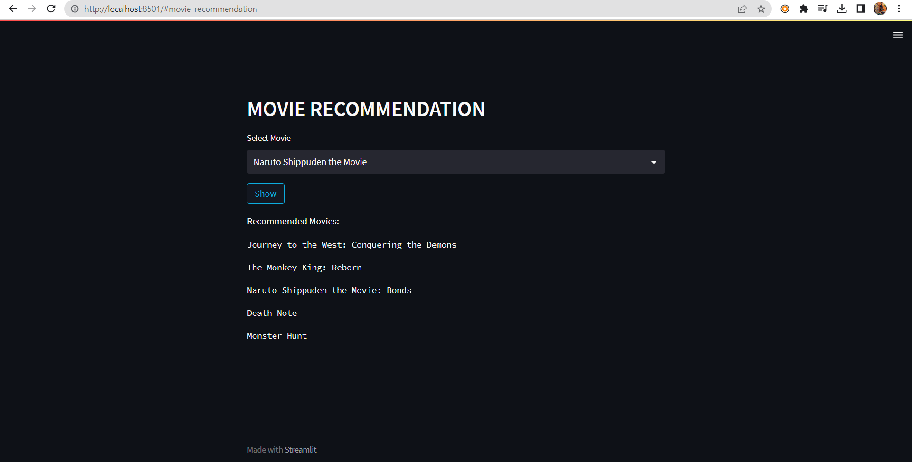
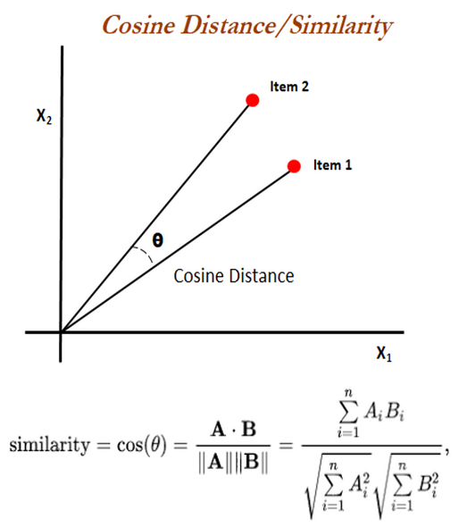

# Movie Recommendation System

This is personal learning project of Movie Recommendation System that I used after my semester break to watch movies.

##
### [DATASET LINK: TMDB Movies Dataset kaggle](https://www.kaggle.com/datasets/ahsanaseer/top-rated-tmdb-movies-10k?fbclid=IwAR2MpWrWpcw2QNCv_FZg2l0sjBh9xAvhrqtnZBO9K-QS6PHI1aHkdB6qLa0)

##

I have used the cosine similarity metric to search for the similar CONTENT BASED Recommendations.

Using python Sklearn library :

- First I convert the movies tags into vector
- Then compare the vectors to find the best similarity.
## How to use ?

- Download the whole code 

- Go to "app.py"

- Open terminal 

- Write: streamlit run app.py
## Appendix 

Libraries used:

pandas, pickle, sklearn for the algorithm

streamlit, pickle for the webpage

